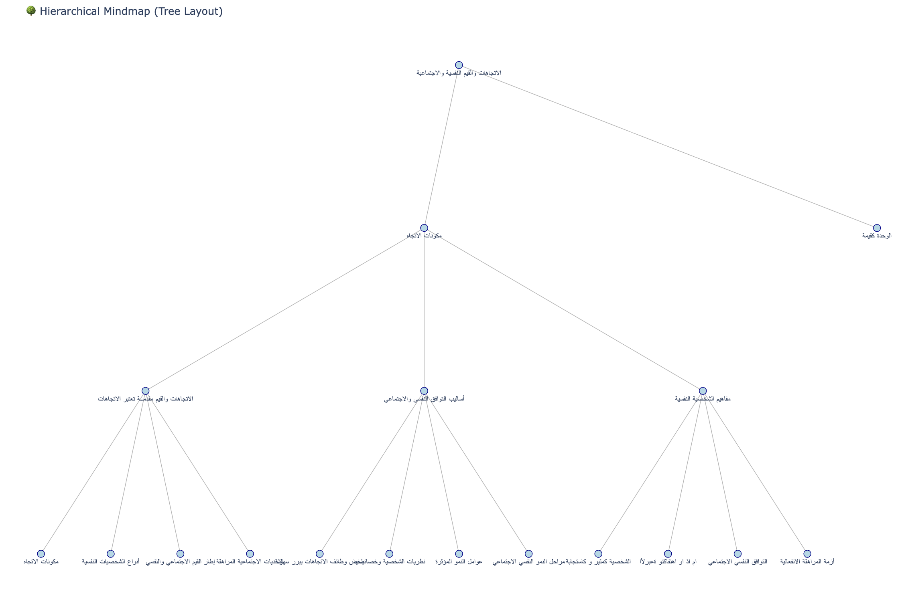

# 🧠 ThoughtFlow

**AI-powered, language-aware mindmap generation.** ThoughtFlow turns raw documents (PDF, JSON, or plain text) into clean, hierarchical mindmaps — detecting the source language, clustering related ideas, and using an LLM to label and describe every node in the document's own language.

<p align="center">
  
  <br>
  <em>A mindmap auto-generated from an Arabic psychology document — labels and descriptions are produced in the source language.</em>
</p>

---

## ✨ Features

- **Language-aware** — detects the input language and generates node labels in the same language (Arabic, and English).
- **Hierarchical clustering** — recursively clusters semantically related content into a meaningful tree.
- **LLM-labeled nodes** — uses a Groq-hosted LLM to produce concise, human-readable topic labels and descriptions.
- **Multilingual embeddings** — sentence-transformer embeddings for cross-lingual semantic understanding.
- **Multiple input formats** — PDF, JSON, and TXT uploads.
- **API-first** — a small, clean FastAPI backend.
- **Interactive visualization** — renders the tree to a standalone, zoomable HTML mindmap.
- **React frontend** — a Vite + React + Radix UI interface for uploading documents and exploring results.

---

## 🏗️ How it works

```
Document (PDF / JSON / TXT)
        │
        ▼
  1. Load & preprocess   →  extract and clean paragraphs
  2. Detect language     →  route cleaning + labeling to the right language
  3. Embed               →  batched multilingual sentence embeddings
  4. Cluster             →  recursive hierarchical clustering into a tree
  5. Enrich (LLM)        →  label + describe each node in the source language
  6. Name the root       →  generate a title for the whole mindmap
        │
        ▼
  Hierarchical mindmap (JSON) → interactive HTML visualization
```

---

## 📁 Repository structure

```
thoughtflow/
├── backend/                     # FastAPI backend + mindmap pipeline
│   ├── main.py                  # API entry point (FastAPI app)
│   ├── config/                  # Settings and configuration
│   ├── database/                # SQLAlchemy models & Pydantic schemas (Mindmap, Node)
│   ├── infrastructure/          # LLM client (Groq) and embedding service
│   ├── src/
│   │   ├── core/                # Cleaning, clustering, labeling, descriptions, naming
│   │   ├── loaders/             # PDF / JSON document loaders
│   │   ├── prompts/             # LLM prompt templates (YAML)
│   │   └── visualizers/         # Mindmap → HTML visualizer
│   ├── utils/                   # Language detection, logging, prompt loading
│   ├── tests/                   # Backend tests
│   └── README.md                # Backend + Docker deployment guide
├── frontend/                    # React + Vite + Radix UI web app
├── scripts/                     # Dev/eval scripts (run from repo root)
│   ├── mindmap_creation.py      # End-to-end pipeline runner
│   ├── mindmap_evaluation.py    # Accuracy evaluation (BERTScore, ROUGE, BLEU)
│   └── test_visualization.py    # Render an enriched tree to HTML
├── docs/images/                 # README assets
├── Dockerfile                   # Multi-stage backend image
└── requirements.txt             # Python dependencies
```

---

## 🚀 Getting started

### Backend

```bash
# 1. Install dependencies
pip install -r requirements.txt

# 2. Configure environment — create a .env in the repo root with your
#    Groq API key, database URL, and any other settings (see backend/config/settings.py)

# 3. Run the API
cd backend
python main.py         # serves on http://0.0.0.0:8000
```

> See [backend/README.md](backend/README.md) for the Docker build and deployment guide.

### Frontend

```bash
cd frontend
npm install
npm run dev            # Vite dev server
```

---

## 🔌 API

The backend exposes a small REST API (default `http://localhost:8000`):

| Method | Endpoint             | Description                                                       |
|--------|----------------------|------------------------------------------------------------------|
| `GET`  | `/health`            | Health check.                                                    |
| `POST` | `/upload`            | Upload a `.pdf`, `.json`, or `.txt` file. Returns a `file_path`. |
| `POST` | `/generate_mindmap`  | Generate a mindmap from an uploaded `file_path`.                 |

**Example — generate a mindmap:**

```bash
# 1. Upload a document
curl -F "file=@document.pdf" http://localhost:8000/upload
# → { "file_path": "uploads/1699999999999_document.pdf", ... }

# 2. Generate the mindmap
curl -X POST http://localhost:8000/generate_mindmap \
  -H "Content-Type: application/json" \
  -d '{"file_path": "uploads/1699999999999_document.pdf", "max_depth": 3, "min_size": 2}'
# → { "mindmap": { ...tree... }, "meta": { "max_depth": 3, "min_size": 2 } }
```

`max_depth` and `min_size` are optional and control how deep and how granular the clustering tree is.

---

## 🧪 Evaluation

`scripts/mindmap_evaluation.py` scores a generated mindmap against a reference using BERTScore, ROUGE, BLEU, and embedding cosine similarity:

```bash
python scripts/mindmap_evaluation.py \
  --mindmap enriched_mindmap.json \
  --reference uploads/<reference>.json \
  --output mindmap_report.json
```

> Dev scripts read/write files relative to the current directory — run them from the repo root.

---

## 🛠️ Tech stack

| Layer             | Technologies                                                                        |
|-------------------|-------------------------------------------------------------------------------------|
| **Backend**       | FastAPI · Uvicorn · Pydantic                                                         |
| **AI / NLP**      | Groq LLM · LangChain · sentence-transformers · spaCy · Stanza · Farasa · langdetect  |
| **Data**          | SQLAlchemy (async) · asyncpg / psycopg2 · PyPDF2                                     |
| **Visualization** | Plotly (interactive HTML mindmaps)                                                  |
| **Frontend**      | React 18 · Vite 6 · TypeScript · Radix UI · Tailwind                                 |
| **Evaluation**    | BERTScore · ROUGE · BLEU (NLTK)                                                      |
| **Deployment**    | Docker (multi-stage build)                                                          |

---

## 📄 License

See [frontend/src/Attributions.md](frontend/src/Attributions.md) for third-party attributions.
